# System Architecture - AI Lead Qualification & Follow-up System

This document explains the architecture components, data flows, and subsystem integrations of the AI Lead Qualification + Follow-up System.

---

## 1. System Block Diagram
The application follows a monolithic single-tier client-server structure designed for fast, local deployment:

```
┌────────────────────────────────────────────────────────────────────────┐
│                        BROWSER FRONTEND (CLIENT)                       │
│  - Single Page Application (app.js, components.js)                      │
│  - Premium SaaS Dashboard View (CSS Grid, Tables, Kanban Columns, Drag) │
│  - Interactive Client Form & Real-time WhatsApp Phone Simulator        │
└──────────────────────────────────┬─────────────────────────────────────┘
                                   │ HTTP REST API
                                   ▼
┌────────────────────────────────────────────────────────────────────────┐
│                        EXPRESS BACKEND (SERVER)                        │
│  - server.js (Server Boot & Routing Middleware)                        │
│  - routes.js (Endpoint Handlers: /api/leads, /stats, /chat, etc.)      │
└──────────────────┬──────────────────────────────┬──────────────────────┘
                   │ Internal JS API              │ JSON Query
                   ▼                              ▼
┌───────────────────────────────────────┐  ┌─────────────────────────────┐
│               AI CORE                 │  │      DATABASE LAYER         │
│  - ai_service.js (Scoring Algorithm)  │  │  - db.js (JSON relational)  │
│  - Local NLP Fallback Templating     │  │  - data/database.json       │
│  - Google Gemini API (Fetch Hook)    │  │                             │
└───────────────────────────────────────┘  └─────────────────────────────┘
```

---

## 2. Lead Capture & Qualification Sequence Diagram
Below is the sequence of actions that occur when a buyer submits a new enquiry form:

```mermaid
sequenceDiagram
    autonumber
    actor Buyer as Buyer / Client
    participant FE as Frontend Dashboard
    participant BE as Express Backend
    participant AI as AI Service
    participant DB as JSON DB
    actor Agent as Sales Agent

    Buyer->>FE: Fills and Submits Lead Form
    FE->>BE: POST /api/leads (Name, Phone, Budget, etc.)
    BE->>DB: Insert new raw lead (Status: 'New')
    BE->>AI: Trigger processLeadQualification(leadId)
    
    rect rgb(20, 30, 50)
        Note over AI: Calculate Score (0-100)<br/>Classify Priority (Hot/Warm/Cold)
        AI->>DB: Assign agent with lowest load (if Hot/Warm)
        AI->>AI: Generate summaries & follow-up messages (Gemini / Fallback)
    end
    
    AI->>DB: Save score, priority, assignment, and template texts
    AI->>DB: Create critical system notification if lead is 'Hot'
    AI->>BE: Return Qualified Lead details
    BE->>FE: JSON Response (201 Created)
    
    alt Lead is Hot
        FE->>FE: Trigger Critical Toast alert on Dashboard
        FE->>FE: Sound notification bell beep and success chimes
    end
    
    FE->>FE: Refresh dashboard charts & table views
    Agent->>FE: Clicks lead -> inspects details
    Agent->>FE: Copy AI WhatsApp template -> clicks "Open in Whatsapp Simulator"
    Agent->>FE: Tests message chat in WhatsApp Frame
```



---

## 3. Core Component Roles

### 3.1. Frontend (`public/js/app.js` and `public/js/components.js`)
- **Single Page Application Routing**: Intercepts navigation clicks to hide and show tab divs without page reloading.
- **Kanban Board Drag & Drop**: Uses HTML5 drag-and-drop triggers. Dropping a lead card in a column triggers `PATCH /api/leads/:id` to record status change.
- **Live Alert Polling**: Uses a background `setInterval` executing every 10 seconds to fetch `/api/alerts`, updating the alert count and triggering popups.

### 3.2. Relational Storage (`backend/db.js`)
- Simulates relational queries (primary keys, foreign keys, cascades) on a single local `data/database.json` file.
- Uses synchronized file writes (`fs.writeFileSync`) to prevent concurrent process write conflicts, making it robust for developer testing.

### 3.3. AI Scoring & Copywriting (`backend/ai_service.js`)
- **Algorithm**: Hard rules assign weights to budget size, purchase speed, and interest layouts.
- **LLM Integration**: Uses native HTTP fetch to send a structured prompt to the Google Gemini model. If network configuration or API keys are missing, it falls back to a deterministic sentence-generator that formats beautiful customized templates.
